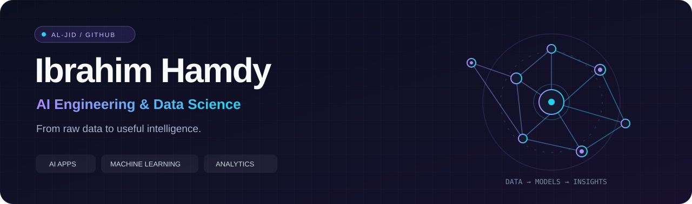

  

  

  
  
  

  
  

## Hi, I'm Ibrahim 👋

I build **AI applications** and explore **data science**, connecting Python APIs, language models, machine learning, and analytics in practical projects.

My work spans AI-assisted knowledge organization, tool-based data analysis, predictive modeling, interactive dashboards, and database-backed applications. I care about making the path from **input → computation → useful output** clear and understandable.

- **AI engineering:** LLM integrations, streaming APIs, structured output, validation, and data analysis tools.
- **Data science:** exploratory analysis, classification, regression, clustering, and statistical modeling.
- **Software foundations:** FastAPI, relational databases, automated tests, Docker, and React interfaces.
- **Business communication:** Power BI dashboards and analytics case studies that explain the data.

## Featured work

<table>
<tr>
<td width="50%" valign="top">
<h3>🧠 ReMindly Agent</h3>

Transforms unstructured knowledge into reusable Markdown through an AI generation, validation, and review pipeline.

<strong>Python · FastAPI · Streaming · Pydantic</strong>

Includes automated tests, a CI workflow, and Docker configuration.

<a href="https://github.com/Al-Jid/ReMindly-Agent">Explore the code →</a> · <a href="https://re-mindly-agent.vercel.app">Demo link →</a>
</td>
<td width="50%" valign="top">
<h3>📊 AI Data Analyst</h3>

Upload a CSV and ask questions. A deterministic planner runs Pandas analysis tools, then an LLM explains the computed results.

<strong>Python · Pandas · FastAPI · React · TypeScript</strong>

Includes dataset summaries, aggregations, filtering, charts, and a fallback without an LLM key.

<a href="https://github.com/Al-Jid/Data-Analysis-Agent">Explore the code →</a>
</td>
</tr>
<tr>
<td width="50%" valign="top">
<h3>🌍 COVID-19 Analytics</h3>

A collaborative analysis of global pandemic data combining Python notebooks, statistical exploration, and Power BI dashboards.

<strong>Pandas · SciPy · Scikit-learn · Power BI</strong>

Includes source datasets, an analysis report, dashboard screenshots, and a PBIX file.

<a href="https://github.com/Al-Jid/COVID-19-Global-Statistical-Analysis-and-Visualization">Explore the analysis →</a>
</td>
<td width="50%" valign="top">
<h3>📈 Power BI Portfolio</h3>

Five collaborative dashboard case studies covering music streaming, retail sales, item performance, and COVID-19 data.

<strong>Power BI · DAX · Power Query · Data Modeling</strong>

Includes report files, datasets, screenshots, and individual project documentation.

<a href="https://github.com/Al-Jid/power-bi-analytics-portfolio">Explore the dashboards →</a>
</td>
</tr>
<tr>
<td width="50%" valign="top">
<h3>🛒 Trendora Control Center</h3>

A full-stack e-commerce project with authentication, roles, product catalogs, carts, orders, caching, and monitoring.

<strong>FastAPI · PostgreSQL · Redis · React · Docker</strong>

Includes database migrations and backend test files.

<a href="https://github.com/Al-Jid/Trendora-Control-Center">Explore the application →</a>
</td>
<td width="50%" valign="top">
<h3>🎓 Oracle University Database</h3>

A collaborative database lab exploring schemas, privileges, triggers, auditing, GPA functions, and academic procedures.

<strong>Oracle XE · PL/SQL · SQL*Plus</strong>

Includes ordered setup scripts and runnable demonstration SQL.

<a href="https://github.com/Al-Jid/Oracle-University-Management-System">Explore the database →</a>
</td>
</tr>
</table>

## Machine learning & analytics

These learning projects explore different modeling tasks. Their notebooks include implementation and evaluation outputs; they are experiments rather than deployed prediction services.

| Project | Focus | Techniques explored |
| :--- | :--- | :--- |
| [Bank subscription prediction](https://github.com/Al-Jid/Bank-Term-Deposit-Subscription-Prediction) | Classification | Logistic regression, Naive Bayes, SMOTE, ROC curves |
| [Audi car price prediction](https://github.com/Al-Jid/Audi-Car-Price-Prediction) | Regression | Linear regression, decision trees, random forests |
| [BigMart sales segmentation](https://github.com/Al-Jid/BigMart-Sales-Customer-Segmentation) | Clustering of item/outlet sales observations | K-Means, DBSCAN, PCA, cluster evaluation |
| [Machine learning project index](https://github.com/Al-Jid/Machine-Learning-Portfolio) | Portfolio navigation | Classification, regression, and clustering |

<!-- contribution-snake -->
## A little motion from my contributions

<picture>
  <source media="(prefers-color-scheme: dark)" srcset="assets/github-snake-dark.svg" />
  <source media="(prefers-color-scheme: light)" srcset="assets/github-snake.svg" />
  
</picture>
